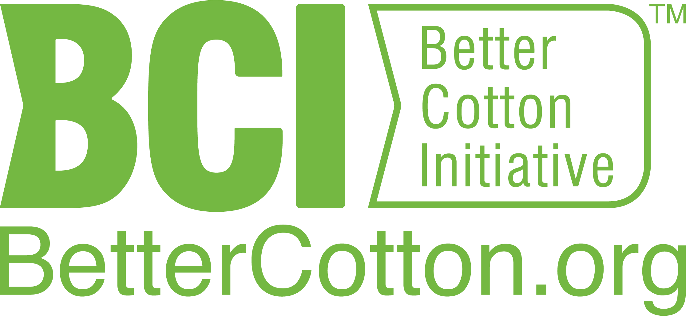
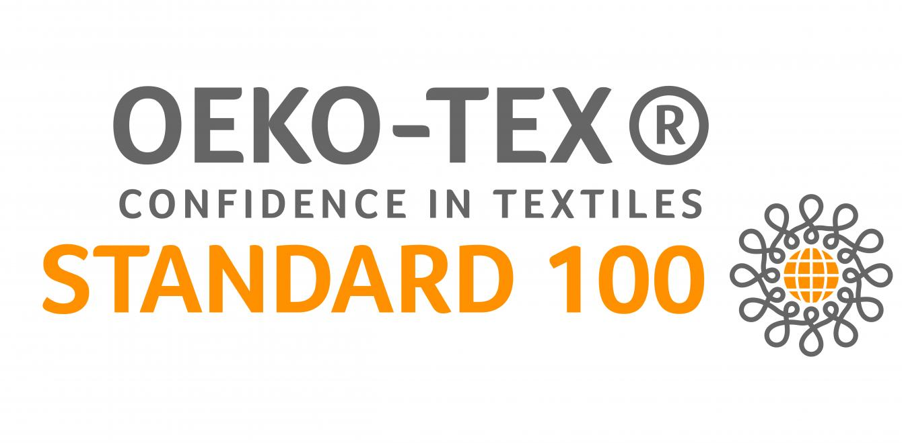
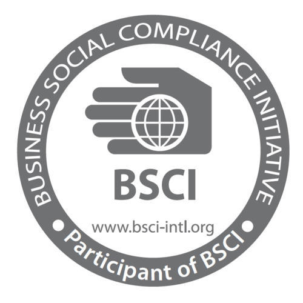

The core of our business is driven by maintaining international standard quality while maintaining the environmental protective standards to ensure sustainable production methods. We have the following certificates:

<Row>
<Col>

</Col>
<Col>

y

</Col>
<Col>

</Col>
</Row>

- **BCI:** The Better Cotton Initiative (BCI) is a global not-for-profit organisation and the largest cotton sustainability programme in the world. BCI exists to make global cotton production better for the people who produce it, better for the environment it grows in and better for the sector’s future.

- **OEKO-TEX:** OEKO-TEX® certification promises that every component of this article, i.e. every thread, button and other accessories, has been tested for harmful substances and that the article therefore is harmless in human ecological terms.

- **BSCI:** Business Social Compliance Initiative BSCI Certification is the regular European stage of retailers, industry and bringing in organizations for checking and improving social gauges in provider nations for all customer products.

Apart from all the compliances maintained, we have, under development, a state-of-the-art **ETP** or **Effluent Treatment Plant** in our project. Currently, we are in the expansion phase and working on our soon-to-come dying unit. Our ETP will completely recover almost all of the dying waste-water, which will be reused.
