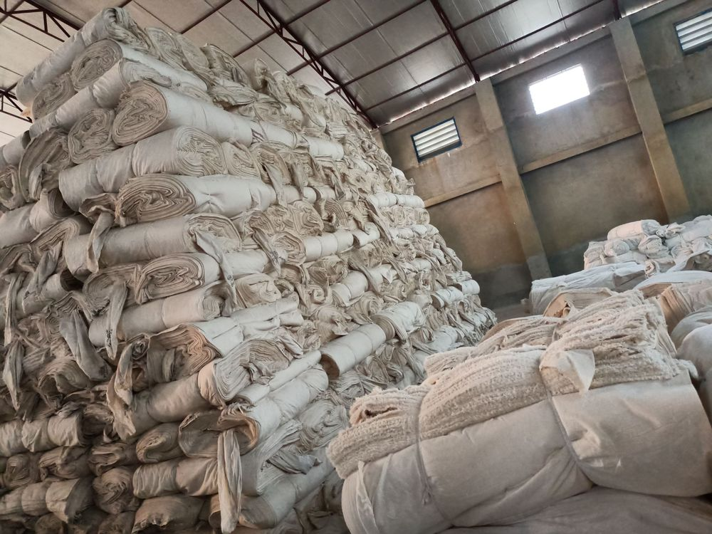
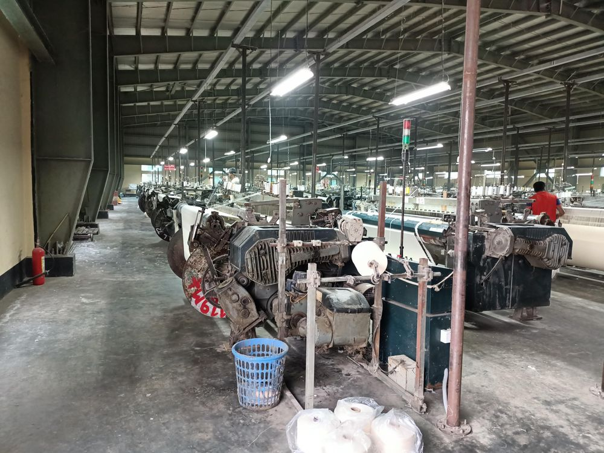
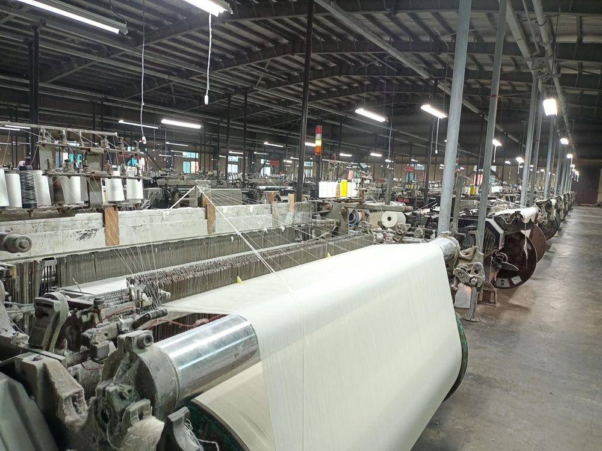
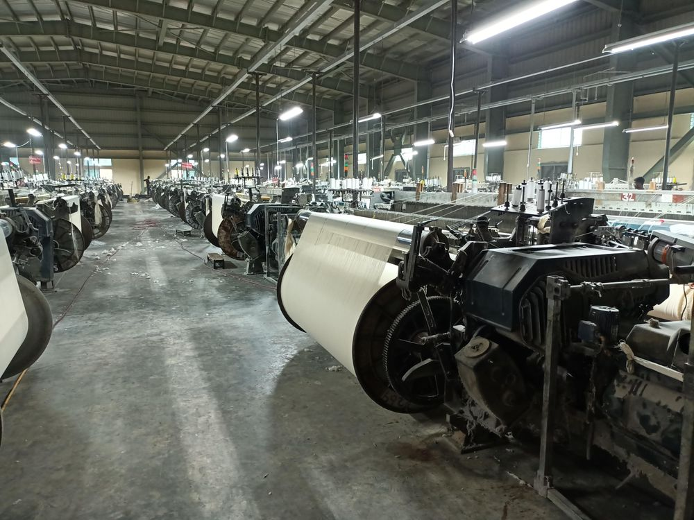

<Row>
<Col>

</Col>
<Col>

</Col>
</Row>

<Row>
<Col>

</Col>
<Col>

</Col>
</Row>

<Row>
<Col>

</Col>
<Col>

</Col>
</Row>

<Row>
<Col>

</Col>
<Col>

</Col>
</Row>

<Row>
<Col>

</Col>
<Col>

</Col>
</Row>

<Row>
<Col>

</Col>
<Col>

</Col>
</Row>

<Row>
<Col>

</Col>
<Col>

</Col>
</Row>

<Row>
<Col>

</Col>
<Col>

</Col>
</Row>

<Row>
<Col>

</Col>
<Col>

</Col>
</Row>
